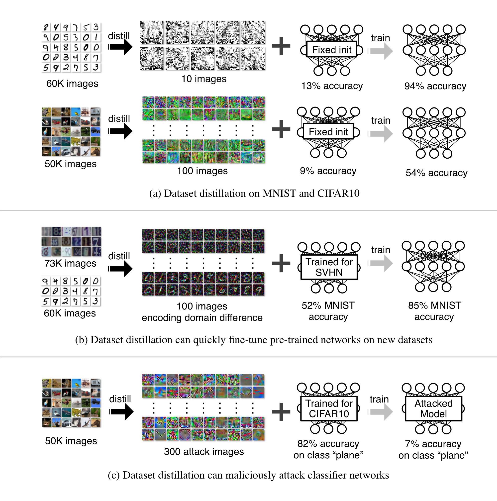

# Dataset Distillation

<p align="center"></p>

[Project Page](https://ssnl.github.io/dataset_distillation/) |  [Paper](https://arxiv.org/pdf/1811.10959.pdf)


We provide a [PyTorch](https://pytorch.org) implementation of [Dataset Distillation](https://ssnl.github.io/dataset_distillation). We distill the knowledge of tens of thousands of images into a few synthetic training images called *distilled images*.

(a): On MNIST, 10 distilled images can train a standard LeNet with a fixed initialization to 94% test accuracy (compared to 99% when fully trained).
On CIFAR10, 100 distilled images can train a deep network with fixed initialization to 54% test accuracy (compared to 80% when fully trained).

(b): We can distill the domain difference between two SVHN and MNIST into 100 distilled images. These images can be used to quickly fine-tune networks trained for SVHN to achieve a high accuracy on MNIST.

(c): Our method can be used to create adversarial attack images. If well-optimized networks retrained with these images for one single
gradient step, they will catastrophically misclassify a particular targeted class.

<!-- **Dataset Distillation**: [Project](https://ssnl.github.io/dataset_distillation), [Paper](https://arxiv.org/pdf/1811.10959.pdf). -->


Dataset Distillation<br>
[Tongzhou Wang](https://ssnl.github.io/), [Jun-Yan Zhu](https://people.eecs.berkeley.edu/~junyanz/), [Antonio Torralba](https://web.mit.edu/torralba/www/), [Alexei A. Efros](https://people.eecs.berkeley.edu/~efros).<br>
arXiv, 2018.<br>
Facebook AI Research, MIT CSAIL, UC Berkeley

The code is written by [Tongzhou Wang](https://ssnl.github.io/) and [Jun-Yan Zhu](https://github.com/junyanz).

## Prerequisites

### System requirements
- Python 3
- CPU or NVIDIA GPU + CUDA

### Dependencies
- ``torch >= 1.0.0``
- ``torchvision >= 0.2.1``
- ``numpy``
- ``matplotlib``
- ``pyyaml``
- ``tqdm``

You may install `PyTorch` (`torch` package above) using any suggested method for your environment [here](https://pytorch.org/get-started/locally/).

## Using this repo

This repo provides the implementation of three different distillation settings described in the paper. Below we describe the basic distillation setting. For other settings and usages, please check out the [Advanced Usage](docs/advanced.md).

### Getting Started

We aim to encapsulate the knowledge of the entire training dataset, which typically contains thousands to millions of images, into a small number of synthetic training images. To achieve this, we optimize these distilled images such that newly initialized network(s) can achieve high performance on a task, after only applying gradient steps on these distilled images.

The distilled images can be optimized either for a  fixed initialization or random unknown ones from a distribution of initializations.

#### Random unknown initialization

The default options are designed for random initializations. In each training iteration, new initial weights are sampled and trained. Such trained distilled images can be generally applied to unseen initial weights, provided that the weights come from the same initialization distribution.

+ `MNIST`:

    ```sh
    python main.py --mode distill_basic --dataset MNIST --arch LeNet
    ```

+ `Cifar10`:

    ```sh
    python main.py --mode distill_basic --dataset Cifar10 --arch AlexCifarNet \
        --distill_lr 0.001
    ```

    `AlexCifarNet` is an architecture adapted from [the `cuda-convnet` project](https://code.google.com/p/cuda-convnet2/) by Alex Krizhevsky.

#### Fixed known initialization

Alternatively, the distilled images can be optimized for a particular initialization, allowing for high performance using even fewer images (e.g., 10 images trains an initialized LeNet to 94% test accuracy).

+ `MNIST`:

    ```sh
    python main.py --mode distill_basic --dataset MNIST --arch LeNet \
        --distill_steps 1 --train_nets_type known_init --n_nets 1 \
        --test_nets_type same_as_train
    ```

+ `Cifar10`:

    ```sh
    python main.py --mode distill_basic --dataset Cifar10 --arch AlexCifarNet \
        --distill_lr 0.001 --train_nets_type known_init --n_nets 1 \
        --test_nets_type same_as_train
    ```

## Citation

If you find this useful for your research, please cite the following paper.

```
@article{wang2018dataset,
  title={Dataset Distillation},
  author={Wang, Tongzhou and Zhu, Jun-Yan and Torralba, Antonio and Efros, Alexei A},
  journal={arXiv preprint arXiv:1811.10959},
  year={2018}
}
```

## Acknowledgements

This work was supported in part by NSF 1524817 on Advancing Visual Recognition with Feature Visualizations, NSF IIS-1633310, and Berkeley Deep Drive.
